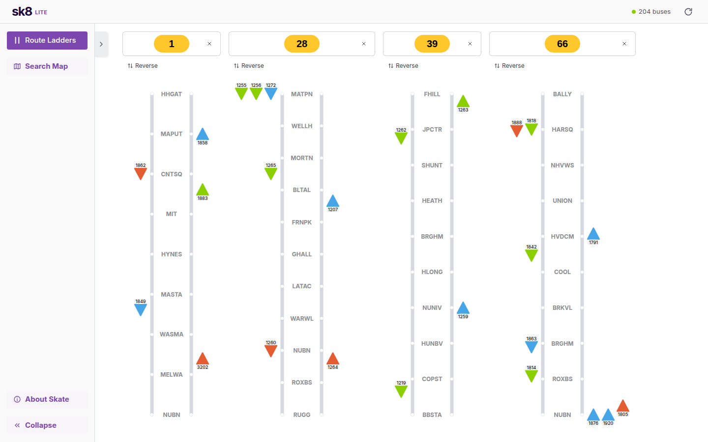

# Skate Lite



An unofficial, Vercel-deployable take on the MBTA's [Skate](https://github.com/mbta/skate) route ladders. It is built only on MBTA public data. It doesn't need Elixir, Postgres, or credentials.

## Features

Styled after Skate's own UI, with a bottom nav on phones.

- **Route Ladders:** live buses placed between timepoints and colored by schedule adherence (red early, green on time, blue late), with schedule lines showing where each bus should be. Each route has a ⋮ menu, Reverse, and Show riders (crowding %).
- **Tabs and presets:** a tab bar (＋ for new tabs, save icon to name and save a set of routes as a preset, double-click a tab to rename) and a Presets tab in the route picker (open, rename, delete). Stored in your browser.
- **Route variations:** like Skate, ladders merge the timepoints of every route pattern (e.g. school trips to Medford High on the 94/95/101/134), the pattern's variant shows inside each bus triangle, and the panel shows it as `101_2` with the pattern description ("School days only").
- **Late View:** buses more than 6 minutes late, for your routes or all routes.
- **Search Map:** every live bus on a map, searchable by bus number, run, or route.
- **Properties panel:** direction, headsign, adherence, run, block, trip, crowding, next stop, and a map.
- **Schedule adherence** is computed from MBTA's public GTFS schedule, so colors work without Swiftly. With `SWIFTLY_API_KEY` set, Swiftly's adherence, runs, and blocks are used instead.

This is original code written to resemble Skate. None of Skate's source, styles, or icons are copied; Skate itself is AGPL-3.0.

## Data sources

| Data | Source | When |
|---|---|---|
| Routes, timepoints, stop order, shapes | `https://cdn.mbta.com/MBTA_GTFS.zip` | At build time (`scripts/build-data.mjs` → `public/data/`) |
| Live bus positions | `https://cdn.mbta.com/realtime/VehiclePositions_enhanced.json` | `/api/vehicles`, cached 10s at the edge, polled every 10s |
| Map tiles | OpenStreetMap (muted with a CSS filter to resemble Skate's basemap) | Browser |

| Early/late, headsign, run, block (optional) | Swiftly real-time vehicles API, if `SWIFTLY_API_KEY` is set | Same `/api/vehicles` call, merged by vehicle ID |

With a Swiftly key, buses are colored the way Skate colors them: red for early (more than 1 minute ahead), green for on time, and blue for late (more than 6 minutes behind). The panel then shows adherence, run and block. The key only ever lives on the server, and the 10-second edge cache means Swiftly is called at most about 6 times a minute however many people have the page open.

**Not included:** operator names, ghost buses, swings, and detours. That data is MBTA-internal.

## Deploy on Vercel

1. Import the GitHub repo in Vercel.
2. Deploy. The framework is detected as Next.js, and the defaults work. `npm run build` runs `prebuild` first, which downloads GTFS and writes `public/data/`.

The schedule data is refreshed on every deploy. MBTA updates GTFS a few times a month, so redeploy occasionally, or set up a Vercel Deploy Hook on a schedule.

Environment variables (see `.env.example`):

- `SWIFTLY_API_KEY` (optional) turns on early/late, run and block. Add it in Vercel under Settings → Environment Variables for Production and Preview, then redeploy.
- `SWIFTLY_AGENCY` (default `mbta`) or `SWIFTLY_VEHICLES_URL` sets which Swiftly feed to read.
- `GTFS_URL` and `VEHICLES_URL` point at other MBTA feeds.

If the header shows `Swiftly: error 401` or `error 404`, the key or agency is wrong.

## Run locally

```shell
npm install
npm run dev
```

The build step also runs automatically in `npm run build`. For `npm run dev`, run `npm run data` once first to create `public/data/`.
